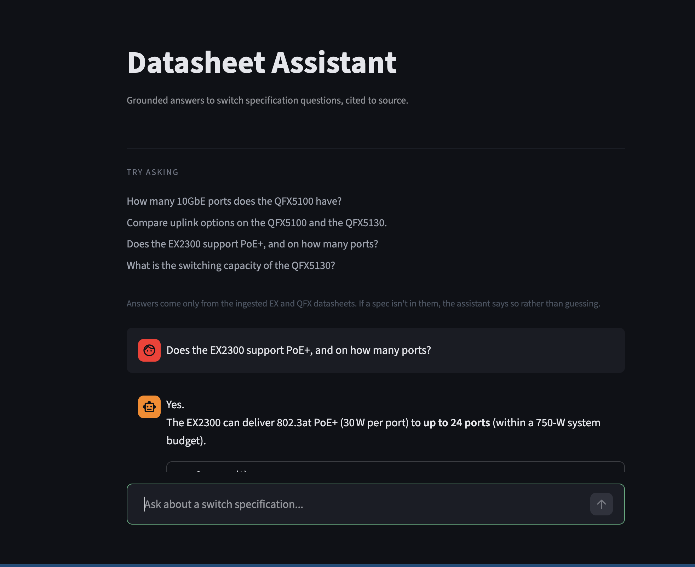

# Datasheet Assistant

A RAG chatbot that answers switch specification questions from vendor
datasheets, and cites which datasheet each answer came from.



Ask "how many 10GbE ports does the QFX5100 have" and get the number that's
actually printed in the PDF — not a plausible-sounding guess. If the spec
isn't in the corpus, it says so.

## How it works

Datasheet PDFs are chunked and embedded locally with sentence-transformers,
then stored in ChromaDB. A question is embedded with the same model, the
closest chunks are retrieved, and an LLM answers using only that context.

## Design notes

**Retrieval is local and free.** Embeddings run on-device via
`all-MiniLM-L6-v2` — no API key, no per-query cost, no data leaving the
machine. Only the final answer step calls a hosted model.

**Chunks are small on purpose.** Datasheets are dense spec tables, so a
600-word chunk sweeps in three unrelated sections and retrieves imprecisely.
At 250 words with 50 overlap, a chunk is roughly one spec block.

**Top-k is 4, not 10.** Ten chunks meant ~8,000 tokens of context per
question. The answer to a spec lookup is almost always in the first few
results; everything after that is padding you pay for. Four cuts token spend
by about 80% with no measurable quality loss.

**Irrelevant chunks get dropped before the model sees them.** Chroma always
returns exactly `TOP_K` results whether or not they're relevant, so a
distance cutoff filters the padding — a narrow question costs a fraction of
a broad one. The best match is always kept, so context is never empty.

**Grounding is enforced in the prompt, not hoped for.** The system prompt
forbids inferring or estimating any spec not present in the retrieved text.
Wrong port counts are worse than "I don't know" when someone is sizing a
deployment.

**The provider is configurable.** Any OpenAI-compatible endpoint works —
Groq, OpenAI, or a local model — set by environment variable, no code change.
Defaults to Groq's free tier so the project runs at zero cost.

## Stack

Python. Streamlit for the UI, ChromaDB for vectors, sentence-transformers for
embeddings, PyMuPDF for PDF extraction, Groq for inference.

<details>
<summary><b>Running it yourself</b></summary>

**1.** Clone and install:

```
python3 -m venv venv && source venv/bin/activate
pip3 install -r requirements.txt
```

**2.** Add datasheet PDFs one level under `datasheets/`, e.g.
`datasheets/EX/EX4400.pdf`. They aren't included in this repo — they're the
vendor's published material and not mine to redistribute. Any switch
datasheet works; source labels are parsed from the filename.

**3.** Get a free API key at [console.groq.com](https://console.groq.com).

**4.** Build the index and run:

```
export LLM_API_KEY="your-key"
python3 ingest.py
streamlit run app.py
```

`python3 check_db.py` lists what's currently ingested.

**Configuration** — all in `config.py`, all overridable by environment
variable:

| Variable | Default | What it does |
| --- | --- | --- |
| `LLM_API_KEY` | — | Required |
| `LLM_BASE_URL` | Groq | Any OpenAI-compatible endpoint |
| `LLM_MODEL` | `openai/gpt-oss-20b` | Model name |

`CHUNK_SIZE`, `CHUNK_OVERLAP`, `TOP_K` and `MAX_DISTANCE` are also in
`config.py`. Changing the chunk settings requires re-running `ingest.py`;
the others take effect immediately.

```
app.py            Streamlit UI
query.py          retrieval + answer generation
ingest.py         PDF extraction, chunking, embedding
check_db.py       lists ingested sources
config.py         all tunable parameters
```

</details>
